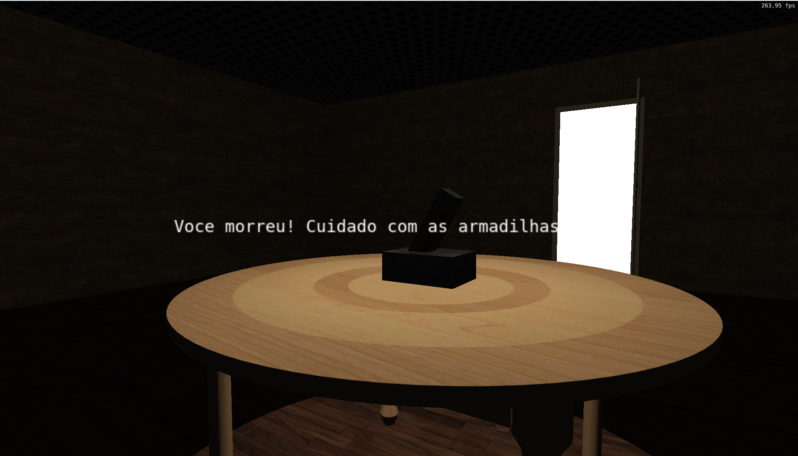
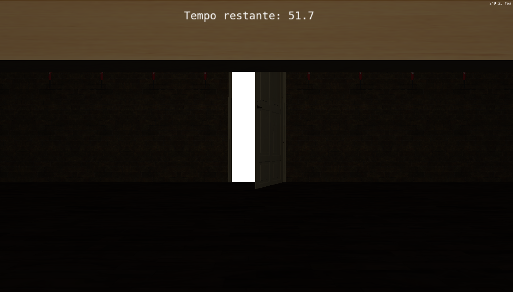

Contribuições por participante:
Felipe:
Rendering
Câmera
Movimentação
Animações

Fernando:
Movimentação
Animações
Sequenciamento do jogo

Pair Programming:
Iluminação

Inteligência Artificial:
A Inteligência artificial foi utilizada para desenvolver a função

Descrição do desenvolvimento:
Ao longo dos laboratórios foi sendo desenvolvida a base do projeto, que foi adaptada para o jogo final. No início, o objetivo era fazer um jogo de labirinto, mas a ideia mudou por conta de dúvidas sobre como funcionaria o carregamento do mapa para um jogo baseado em um espaço menor (sala única). Parte do desenvolvimento foi feito em conjunto (pair programming), mas a maior parte foi feita separadamente por cada integrante.

Imagem após morrer para as armadilhas.

Imagem da porta se abrindo, observada por debaixo da mesa.

Controles do jogo:
Movimentação da câmera: Mouse
Movimentação básica: WASD
Pulo: Barra de Espaço
Agachar: Tecla Ctrl
Iniciar jogo: Tecla ENTER
Encerrar jogo: Tecla Esc

Passo a passo de execução (copiado do arquivo LEIAME.txt):
--- Windows com VSCode (Visual Studio Code)
-------------------------------------------
1) Instale o VSCode seguindo as instruções em https://code.visualstudio.com/ .

2) Instale o compilador GCC no Windows seguindo as instruções em
https://code.visualstudio.com/docs/cpp/config-mingw#_installing-the-mingww64-toolchain .

Alternativamente, se você já possui o Code::Blocks instalado no seu PC
(versão que inclui o MinGW), você pode utilizar o GCC que vem com esta
instalação no passo 5.

3) Instale o CMake seguindo as instruções em https://cmake.org/download/ .
Alternativamente, você pode utilizar algum package manager do
Windows para fazer esta instalação, como https://chocolatey.org/ .

4) Instale as extensões "ms-vscode.cpptools" e "ms-vscode.cmake-tools"
no VSCode. Se você abrir o diretório deste projeto no VSCode,
automaticamente será sugerida a instalação destas extensões (pois
estão listadas no arquivo ".vscode/extensions.json").

5) Abra as configurações da extensão cmake-tools (Ctrl-Shift-P e
busque por "CMake: Open CMake Tools Extension Settings"), e adicione o
caminho de instalação do GCC na opção de configuração "additionalCompilerSearchDirs".

Por exemplo, se você quiser utilizar o compilador MinGW que vem junto
com o Code::Blocks, pode preencher o diretório como
"C:\Program Files\CodeBlocks\MinGW\bin" (verifique se este é o local
de instalação do seu Code::Blocks).

6) Clique no botão de "Play" na barra inferior do VSCode para compilar
e executar o projeto. Na primeira compilação, a extensão do CMake para
o VSCode irá perguntar qual compilador você quer utilizar. Selecione
da lista o compilador GCC que você instalou com o MSYS/MinGW.

Veja mais instruções de uso do CMake no VSCode em:

https://github.com/microsoft/vscode-cmake-tools/blob/main/docs/README.md

=== Linux
===================================
Para compilar e executar este projeto no Linux, primeiro você precisa instalar
as bibliotecas necessárias. Para tanto, execute o comando abaixo em um terminal.
Esse é normalmente suficiente em uma instalação de Linux Ubuntu:

    sudo apt-get install build-essential make libx11-dev libxrandr-dev \
                         libxinerama-dev libxcursor-dev libxcb1-dev libxext-dev \
                         libxrender-dev libxfixes-dev libxau-dev libxdmcp-dev

Se você usa Linux Mint, talvez seja necessário instalar mais algumas bibliotecas:

    sudo apt-get install libmesa-dev libxxf86vm-dev

Após a instalação das bibliotecas acima, você possui várias opções para compilação:

--- Linux com Makefile
-------------------------------------------
Abra um terminal, navegue até a pasta "Laboratorio_0X_Codigo_Fonte", e execute
o comando "make" para compilar. Para executar o código compilado, execute o
comando "make run".

--- Linux com CMake
-------------------------------------------
Abra um terminal, navegue até a pasta "Laboratorio_0X_Codigo_Fonte", e execute
os seguintes comandos:

    mkdir build  # Cria diretório de build
    cd build     # Entra no diretório
    cmake ..     # Realiza a configuração do projeto com o CMake
    make         # Realiza a compilação
    make run     # Executa o código compilado

--- Linux com VSCode
-------------------------------------------

1) Instale o VSCode seguindo as instruções em https://code.visualstudio.com/ .

2) Instale as extensões "ms-vscode.cpptools" e "ms-vscode.cmake-tools"
no VSCode. Se você abrir o diretório deste projeto no VSCode,
automaticamente será sugerida a instalação destas extensões (pois
estão listadas no arquivo ".vscode/extensions.json").

3) Clique no botão de "Play" na barra inferior do VSCode para compilar
e executar o projeto. Na primeira compilação, a extensão do CMake para
o VSCode irá perguntar qual compilador você quer utilizar. Selecione
da lista o compilador que você deseja utilizar.

Veja mais instruções de uso do CMake no VSCode em:

https://github.com/microsoft/vscode-cmake-tools/blob/main/docs/README.md

--- Linux com Code::Blocks
-------------------------------------------
Instale a IDE Code::Blocks (versão Linux em http://codeblocks.org/), abra o
arquivo "Laboratorio_X.cbp", e modifique o "Build target" de "Debug" para "Linux".

=== macOS
===================================
Para compilar e executar esse projeto no macOS, primeiro você precisa instalar o
HOMEBREW, um gerenciador de pacotes para facilitar a instação de bibliotecas. O
HOMEBREW pode ser instalado com o seguinte comando no terminal:

    /usr/bin/ruby -e "$(curl -fsSL https://raw.githubusercontent.com/Homebrew/install/master/install)"

Após a instalação do HOMEBREW, a biblioteca GLFW deve ser instalada. Isso pode
ser feito pelo terminal com o comando:

    brew install glfw

--- macOS com Makefile
-------------------------------------------
Abra um terminal, navegue até a pasta "Laboratorio_0X_Codigo_Fonte", e execute
o comando "make -f Makefile.macOS" para compilar. Para executar o código
compilado, execute o comando "make -f Makefile.macOS run".

Observação: a versão atual da IDE Code::Blocks é bastante desatualizada pra o
macOS. A nota oficial dos desenvolvedores é: "Code::Blocks 17.12 for Mac is
currently not available due to the lack of Mac developers, or developers that
own a Mac. We could use an extra Mac developer (or two) to work on Mac
compatibility issues."

--- macOS com CMake
-------------------------------------------
Você utiliza macOS e conseguiu utilizar o CMake para compilar este projeto?
Então mande um e-mail para o professor em <eslgastal@inf.ufrgs.br> com
as alterações necessárias no CMakeLists.txt e uma lista de instruções
para colocar neste LEIAME.txt .

=== Soluções de Problemas
===================================

Caso você tenha problemas de compilação no Windows com GCC, cuide para
extrair o código do laboratório em um caminho que não contenha espaços
no nome de algum diretório:

- Caminho OK: C:\Users\JohnDoe\Documents\FCG\Lab1

- Caminho NÃO OK: C:\Users\JohnDoe\Documents\Fundamentos de CG\Lab1

Caso você tenha problemas em executar o código deste projeto, tente atualizar o
driver da sua placa de vídeo.